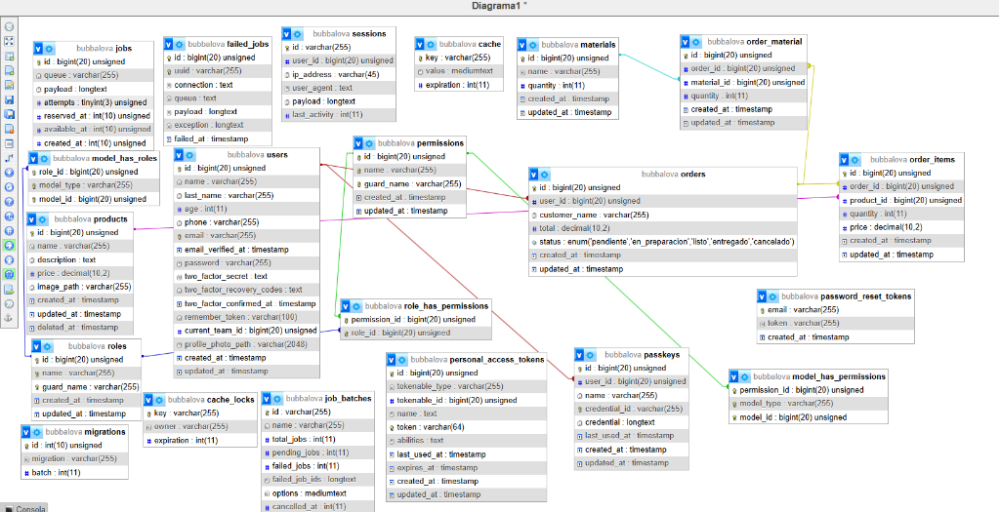

# Peto-BubbaLova 
Proyecto de gestión para **BobbaLova** un sistema para el control de pedidos, inventario de materiales, y administración.

## Instrucciones de Ejecución

### Paso 1 - Clonar el proyecto
Clona el repositorio e instala las dependencias de PHP y JavaScript:
```bash
composer install
npm install
```
---
### Paso 2 - Iniciar el servidor
Inicia el servidor local con:
```bash
# Servidor Backend local en el puerto 8001
php artisan serve --port=8001

# Compilación Frontend para los estilos
npm run dev

# Para poder activar las tareas Programadas / Envío de correos automáticos:
php artisan schedule:work
```
---

# Credenciales de Prueba (Roles)

### Administrador
* **Usuario Administrador**: `adrianyamq@gmail.com`
* **Contraseña**: `password`
* `El administrador puede cambiar y generar las contraseñas de nuevos usuarios`

### Cocineros
* **Usuario1**: `kan@gmail.com`
* **Contraseña**: `12345678`

* **Usuario2**: `camellia@gmail.com`
* **Contraseña**: `12345678`

### Cajeros
* **Usuario2**: `kana@gmail.com`
* **Contraseña**: `12345678`

* **Usuario2**: `mari@gmail.com`
* **Contraseña**: `12345678`

---

# Diagrama Entidad-Relacion



